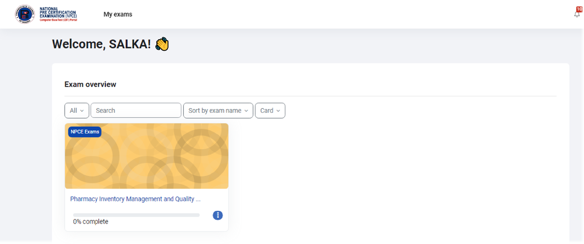
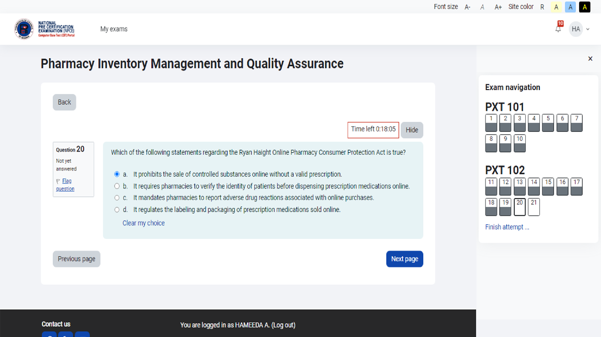
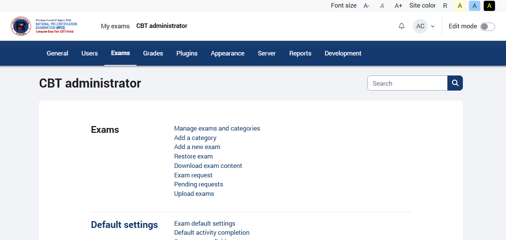
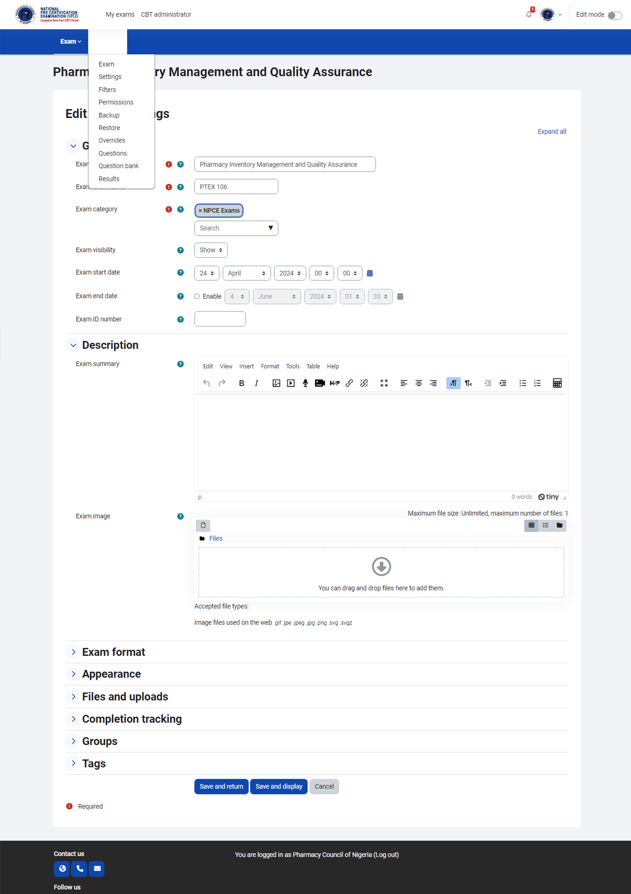

# 🧪 CBT System (Offline-First Nationwide Deployment)

🚀 A production-ready CBT system used to conduct nationwide exams across Nigeria — built for low-connectivity environments.

---

## 🎯 Project Overview

This project demonstrates the deployment of a **scalable Computer-Based Testing (CBT) system** designed to operate reliably in environments with limited or unstable internet access.

---

## 🌍 Real-World Case Study

### Nationwide CBT Deployment Across 36 States (Offline + Centralized Results)

Successfully deployed and managed a large-scale CBT examination for **Pharmacy Technician candidates across all 36 states in Nigeria**.

---

## 🚧 The Challenge

Conducting nationwide CBT exams in Nigeria presents several constraints:

- Unstable or unavailable internet connectivity  
- Risk of exam disruption during live sessions  
- Difficulty in collecting results centrally  
- Infrastructure limitations across multiple locations  

---

## 💡 The Solution

The system was designed with an **offline-first architecture**:

- Each CBT center runs exams on a **local Moodle server (LAN-based)**  
- No internet required during the exam  
- Results are stored locally during the session  
- A custom plugin (**SendResults**) handles synchronization  

Once internet becomes available:
- Results are securely transmitted to a **central server**
- Data is aggregated for nationwide processing  

---

## 🧩 Key Features

- 🖥️ Offline CBT delivery across multiple centers  
- 🔄 Centralized result synchronization  
- 📤 CSV + JSON result export  
- 📧 Email-based result delivery  
- 🔐 Controlled access for CBT administrators  
- 🌐 Retry mechanism for unstable internet connections  

---

## ⚙️ Technologies Used

- Moodle 4.4 (Customized)
- PHP (Plugin Development)
- MariaDB
- Apache Server
- Redis
- JavaScript

---

## 🔌 Custom Plugin: SendResults

A custom-built Moodle plugin responsible for:

- Generating CSV and JSON result files  
- Sending results to a central API endpoint  
- Handling retries in case of network failure  
- Emailing results automatically  
- Identifying each CBT center via server naming  

---

## 🧠 System Architecture
      ┌────────────────────┐
      │   Student Devices  │
      └─────────┬──────────┘
                │
          (LAN Network)
                │
      ┌─────────▼──────────┐
      │  Moodle CBT Server │
      │ (Local Deployment) │
      └─────────┬──────────┘
                │
      ┌─────────▼──────────┐
      │  SendResults Plugin│
      └─────────┬──────────┘
                │
    Internet (When Available)
                │
      ┌─────────▼──────────┐
      │   Central Server   │
      └─────────┬──────────┘
                │
      ┌─────────▼──────────┐
      │ Email / Database   │
      └────────────────────┘

      
---

## 📈 Impact

- ✅ Successfully conducted exams across all 36 states  
- ✅ Eliminated dependency on real-time internet  
- ✅ Ensured zero disruption during exams  
- ✅ Enabled reliable nationwide result aggregation  

---

## 🌍 Why This Matters

This project addresses **real infrastructure challenges in large-scale digital examinations**, particularly in regions with unreliable connectivity.

It proves that **robust, scalable CBT systems can be deployed without requiring constant internet access**.

---

## 📸 Screenshots

### 🖥️ Candidate Dashboard

---

### 🖥️ CBT Exam Interface

---

### ⚙️ Admin Control Panel

---

### 📊 Exams Setup

---

## 📬 Contact

- LinkedIn: https://www.linkedin.com/in/lusasms/  
- Email: ndagba4me@gmail.com  

---

🚀 *Open to collaborations and remote opportunities*
